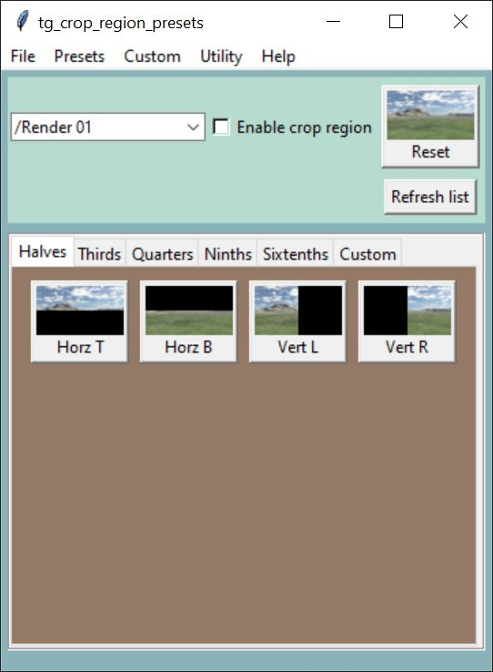
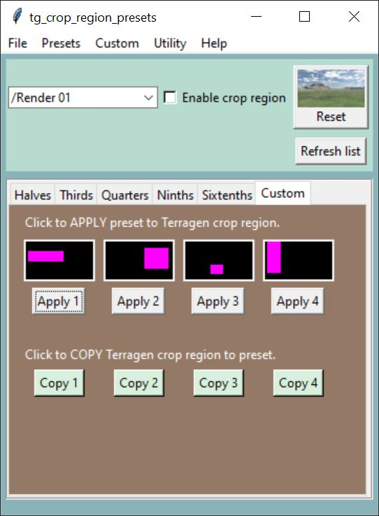

# tg-crop-region-presets

A fully functional Python script implementing Terragen 4 Professional’s remote procedure call (RPC) feature to allow the user to apply crop region presets to a selected renderer in the active Terragen project.  Custom crop region presets can be saved to disk and reloaded.

### Requirements:

Terragen 4 Professional v4.6.31 (or later)  
https://planetside.co.uk/

terragen-rpc  
https://github.com/planetside-software/terragen-rpc

Pillow  
https://pypi.org/project/Pillow/

### Installation:

Make sure you’ve installed Terragen 4 Professional v4.6.31 or greater on your computer, and installed the terragen_rpc module and Pillow fork, via the pip install command.  

In this repository you’ll find the Python script “tg_crop_region_presets.py” and supporting example content. The images folder contains an icon file, should you wish to create a shortcut on your desktop for the python script, as well as the bitmap images used for the button widgets on the graphic interface.

### Usage:
  

The interface is divided into two main sections.  The upper section allows you to choose a renderer from the drop-down list or refresh the list, as well as to activate, deactivate, or reset the renderer’s crop region feature.  The lower section is divided into tabs, based on common resolution sub-divisions, such as half, thirds, quarters, etc.  Clicking on a button will apply the crop region preset to the  selected renderer.    

The Custom tab allows you to copy the current crop region to a buffer, or to apply the contents of the buffer to the selected renderer.  An approximation of the buffer’s content is displayed as well.  

  

There is a menubar at the top, providing alternate selection methods and additional features, such as saving the custom crop region presets to disk, and adding a renderer to the project.  

### Known issues:

In this Python script it’s possible to apply a crop region preset to a renderer that is not the one currently being used for display in the 3D preview.  When this occurs, the 3D preview will update the crop region bounding box to the new values, requiring you to refresh the 3D preview in order to display the correct crop-region settings for that renderer.   

### Reference:

terragen-rpc  
https://github.com/planetside-software/terragen-rpc

Online documentation for Terragen RPC  
https://planetside.co.uk/docs/terragen-rpc/

Blog posts on using Terragen RPC  
https://planetside.co.uk/blog/hello-rpc-part-1-scripting-for-terragen/  
https://planetside.co.uk/blog/hello-rpc-part-2-error-handling/  
https://planetside.co.uk/blog/script-it-yourself-kelvin-sunlight-colour-with-terragen-rpc/  
